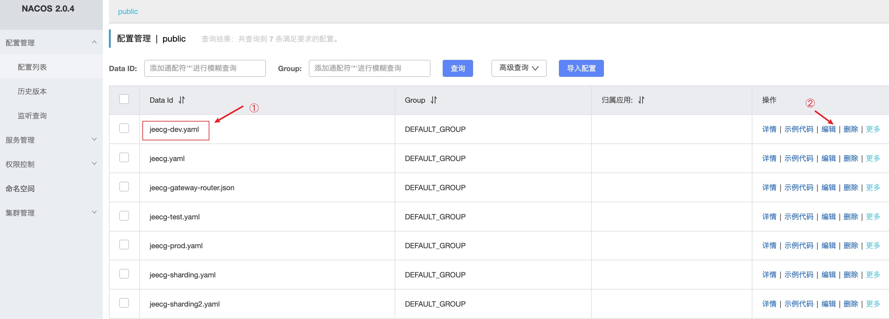
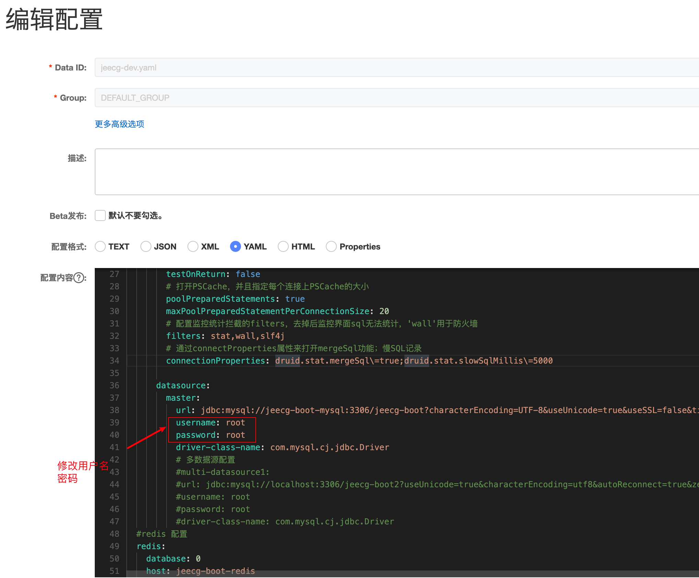

# jeecg 微服务部署

参考:

- [微服务部署](http://doc.jeecg.com/2186816)
- [微服务Docker镜像制作 3.1+](http://doc.jeecg.com/2656147)
- [单体切换微服务 3.2+](http://doc.jeecg.com/2704725)
- [CentOS 7 MySQL 的安装](https://blog.csdn.net/miaodichiyou/article/details/99289160)
- [How to Grant All Privileges on a Database in MySQL](https://chartio.com/resources/tutorials/how-to-grant-all-privileges-on-a-database-in-mysql/)
- [nginx location/区别详解](https://www.jb51.net/article/244331.htm)
- [CentOS 7 Nginx 安装](https://juejin.cn/post/6844904134345228301)

## 环境准备

### 数据库安装

- 安装 mysql
    - 直接在 centos 上安装
        - 安装客户端和服务器: `yum -y install mariadb  mariadb-devel  mariadb-server`。(由于MySQL在CentOS7中收费了，所以已经不支持MySQL了，取而代之在CentOS7内部集成了mariadb)
        - 启动 mysql 服务: `systemctl start mariadb.service`
        - 设置开机启动: `systemctl enable mariadb.service`
        - 设置管理员密码
        - 为 root 用户提供外网访问的能力(不仅仅是本机)
            1. 通过 `mysql -u root -p` 登录到本机
            2. 侦听所有 IP 的 3306 端口，而非仅为 localhost
                - 仅为 root 设置: `GRANT ALL PRIVILEGES ON *.* TO 'root'@'%' IDENTIFIED BY '12345678';` 
                - 创建新的账号上并设置: `GRANT ALL PRIVILEGES ON *.* TO 'fff'@'%' IDENTIFIED BY '12345678';`
                - 查看授权: `SHOW GRANTS FOR 'fff'@'%';`
                - 如果要删除新账号: `DROP USER 'fff'@'%';`
            3. 刷新权限: `FLUSH PRIVILEGES;`
    - 通过 docker 或 k8s 安装
- 安装 redis
    - 直接在 centos 上安装
        - 添加EPEL仓库: `yum install epel-release`
        - 更新yum源: `yum update`，经过测试，这一步可以跳过
        - 安装软件: `yum -y install redis`
        - 配置 */etc/redis.conf*，注释其中的 `bind 127.0.0.1`，使其可以被其他机子访问
        - 启动 redis 服务: `systemctl start redis`
        - 设置开机启动 `systemctl enable redis`
    - 通过 docker 或 k8s 安装

### 数据库初始化

分别执行 sql 文件夹中的 jeecgboot-mysql-5.7.sql、tables_nacos.sql、tables_xxl_job.sql、vue3-update.sql。

## 编译并运行系统

### 后端部署

设置 */etc/hosts* ，添加如下内容：
```
127.0.0.1 jeecg-boot-redis
127.0.0.1 jeecg-boot-mysql
127.0.0.1 jeecg-boot-nacos
127.0.0.1 jeecg-boot-gateway
127.0.0.1 jeecg-boot-system
127.0.0.1 jeecg-boot-sentinel
127.0.0.1 jeecg-boot-xxljob
127.0.0.1 jeecg-boot-rabbitmq
```
jeecg-boot-redis、jeecg-boot-mysql、jeecg-boot-nacos、jeecg-boot-gateway、jeecg-boot-system 都按实际地址进行配置。或者是通过一个 dns 服务器进行统一配置。

nacos 是系统的配置和注册发现中心。

解压 *jeecg-boot.tar.bz2* 文件: `tar -xvf jeecg-boot.tar.bz2`。

修改文件 *jeecg-cloud-module/jeecg-cloud-nacos/src/main/resources/application.yml*，修改数据库的IP地址、端口号、用户名、密码等信息。
```yaml
db:
  num: 1
  password:
    '0': ${MYSQL-PWD:12345678}
  url:
    '0': jdbc:mysql://${MYSQL-HOST:jeecg-boot-mysql}:${MYSQL-PORT:3306}/${MYSQL-DB:nacos}?characterEncoding=utf8&connectTimeout=1000&socketTimeout=3000&autoReconnect=true&useUnicode=true&useSSL=false&serverTimezone=UTC&allowPublicKeyRetrieval=true
  user:
    '0': ${MYSQL-USER:root}
```

编译微服务: `mvn package -Pdev,SpringCloud`。

- jeecg-cloud-nacos-3.2.0.jar 即为注册与配置中心。
- jeecg-cloud-system-start-3.2.0.jar 即为 jeecg 平台的服务。
- jeecg-cloud-gateway-3.2.0.jar 即为路由。


先通过 `java -jar jeecg-cloud-nacos-3.2.0.jar` 命令启动 nacos 服务。通过 `IP:8848/nacos` 访问 nacos，使用默认的 nacos/nacos 进行登录。修改其中的 jeecg.yaml 配置:



修改其中的用户名、密码等信息。



通过 `java -jar jeecg-cloud-system-start-3.2.0.jar` 命令启动jeecg平台。

通过 `java -jar jeecg-cloud-gateway-3.2.0.jar` 启动路由功能。

### 前端部署

- 安装 Nginx，参考 [CentOS 7 Nginx 安装](https://juejin.cn/post/6844904134345228301)
- 通过 `yarn install` 安装依赖包
- 通过 `yarn build` 进行编译，生成 *dist* 文件夹
- 将 *dist* 文件夹作为静态文件夹，配置到 nginx 中，例如将 *dist* 中的内容放在 */var/www/jeecg-vue3* 中
- 配置 nginx，添加如下内容：
```conf
http {
    ...
    server {
        # 添加的内容开始
        location ^~ /jeecgboot/ {
            proxy_pass http://127.0.0.1:9999/;  # 将 IP 地址修改为真实的 gateway 服务器的 IP
            proxy_set_header        Host 127.0.0.1;
            proxy_set_header        X-Real-IP $remote_addr;
            proxy_set_header        X-Forwarded-For $proxy_add_x_forwarded_for;
        }
        # 添加的内容结束

        # 修改内容开始
        location / {
            #root   share/nginx/html;
            root   /var/www/jeecg-vue3;
            index  index.html index.htm;
        }
        # 修改内容结束
    }
}
```
这里注意 [nginx location/区别问题](https://www.jb51.net/article/244331.htm) 。


